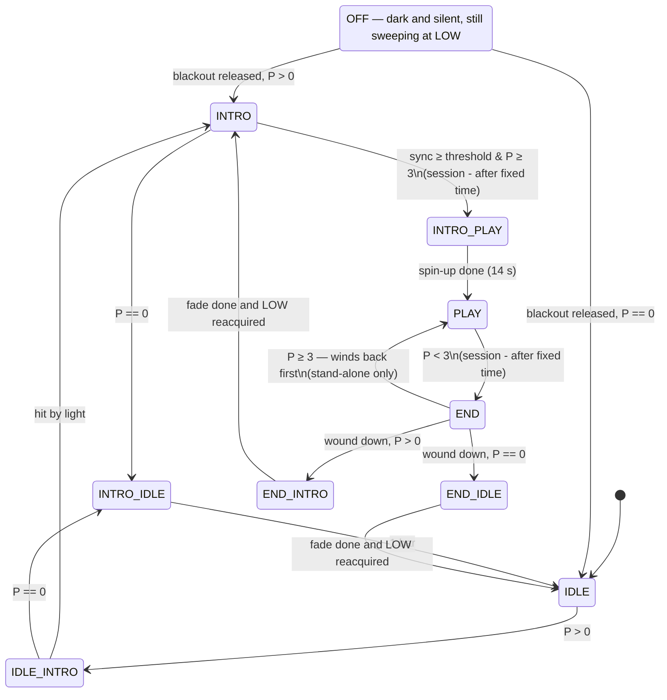

# White Space — States

Ten states played by the `StateMachine` (`apps/white_space/statemachine/`).
This document is the source of truth for the installation's dramaturgy. Each state's description
is mirrored as the docstring of its class in `statemachine/states.py`; transition lists below
are in **priority order**, matching each class's `needs_state_change()`. Timing tunables live
in the `statemachine` settings group; layer choices in each state's `update()`.

Vocabulary: **P** = debounced live participant count · **bar** = one full playhead cycle
(the content clock) · **hit** = the playhead sweeps past a participant · **low layers**
write the four bar lights (front/back white, left/right blue) · **high layers** draw
the persistence-of-vision ring · **readout mode** = the fixture's own regime switch, on
the *commanded* rpm: slot mode (the four lamps driven directly) below 200 rpm, ring mode
at or above — it flips on receipt of the rpm, not when the bar is actually fast or slow,
so a wind-down is in slot mode from its first packet and a spin-up in ring mode from its
first packet · **motor lock** = the playhead has re-synced
to the measured rotation *at LOW speed* (its re-lock gate: a fresh measurement settling
within tolerance of `low_rpm` — not merely "under the 200 RPM sensor ceiling", and immune
to stale spin-down readings) · **un-lock** = the raw measured speed passes the ceiling on
the way up (the lamp bar physically blurring into the ring).

## Summary

| #  | State      | P        | Duration      | Motor   | White light                      | Blue light                | Pose sound           | Secondary sound                |
|----|------------|----------|---------------|---------|----------------------------------|---------------------------|----------------------|--------------------------------|
| S0 | OFF        | —        | ∞ (blackout)  | LOW     | none                             | none                      | no                   | no                             |
| S1 | IDLE       | 0        | ∞             | LOW     | BRIGHT line                      | sound visuals             | no                   | searchlight soundscape         |
| S2 | IDLE_INTRO | > 0      | until hit     | LOW     | BRIGHT line                      | sound visuals             | yes (pre-hit)        | searchlight + anticipatory cue |
| S3 | INTRO      | > 0      | ∞             | LOW     | DIM line + flash on hit          | none                      | yes (only)           | none                           |
| S4 | INTRO_IDLE | 0        | 1 bar         | LOW     | fade DIM → BRIGHT                | fade-in sound visuals     | no                   | fade-in soundscape             |
| S5 | INTRO_PLAY | ≥ 3      | 14 s spin-up  | HIGH    | instrument + playhead at un-lock | pose instrument (ease in) | yes (effect?)        | enhance spin-up chaos          |
| S6 | PLAY       | ≥ 3      | ∞             | HIGH    | pose instrument + playhead       | pose instrument           | yes                  | enhance spin                   |
| S7 | END        | < 3      | N bars (↔)    | HIGH    | instrument + playhead → full     | fade-out instrument       | distortion?          | fade-out spin + distortion?    |
| S8 | END_INTRO  | < 3, > 0 | spin-down (fade, then lock) | LOW | wall fades → DIM over the spin-down | none                | fade out distortion? | fade out distortion?           |
| S9 | END_IDLE   | 0        | spin-down (fade, then lock) | LOW | stays BRIGHT, back lamp fades out | fade-in sound visuals | fade out distortion? | fade out distortion?           |

## Transition graph

The machine always **boots into IDLE** (failsafe — the persisted `manual.select` is only
the goto target, and `manual.hold` and `blackout` are forced off at construction: a
power-cycled installation resumes the show unattended, never dark). **OFF (S0)** is
entered from any state by pinning `blackout` (an operator input, so it is not drawn as
an edge above) and leaves it by condition like any other state. In **session mode** the
two open-ended states (INTRO, PLAY) gain timed exits, and END only winds down (no return
to PLAY), so a session always concludes.

**Boot invariant — the motor NEVER powers on into HIGH.** Every path that could command
HIGH at boot is guarded, and each guard has a unit test:

1. **State machine**: always boots into IDLE (motor LOW), ignoring the persisted `select`
   — a preset saved mid-show can never boot into a HIGH state (`statemachine/machine.py`;
   `test_startup_ignores_persisted_select`).
2. **Motor**: there is no manual mode field — the arbitration is debug > machine command >
   **STOPPED**, so before the machine's first tick (or with the machine disabled) nothing
   spins (`light/motor.py` `_target_mode`; `test_boot_without_command_is_stopped`).
3. **Debug**: the Conductor forces the `light.debug` select back to OFF at construction —
   a preset saved with a high layer selected can never auto-follow to HIGH at power-on
   (`light/conductor.py`; `test_boot_failsafe_clears_debug`).

On top of these, `osc_light` holds the commanded rpm at 0 for `startup_delay` seconds
after connecting, giving the motor controller one clean 0 → target edge. HIGH is
therefore reachable only through an explicit runtime action: the show's own sync into
INTRO_PLAY, an operator goto to a HIGH state, or selecting a high layer in the debug
select. **Any future change to boot, arbitration, or the debug select must preserve
this invariant.**

**Hardware failsafe**: if the machine does not rotate, it turns the lights off — so a
stalled spin-down can never strand bright lights on a stationary bar. A sensor failure on
a machine that *is* still spinning can hold a state (e.g. S8/S9 waiting for lock); that is
an operator-intervention case (`goto` / the debug select), not a safety one.

**Shutdown**: a clean quit ends with an explicit **blackout from each sender** — the
light sender sends rpm 0, an all-zero frame, and rpm 0 again (fixture dark and
decelerating at once); the sound sender sends its zeroed bundle (`/global/state` −1).
The firmware's Ethernet watchdog (packet silence → motor stop + blank after several
revolutions) covers only the crash path, where `stop()` never runs.

## Layers

Each state composes its **mix**: a weighted list of layers, returned every tick
(`p` = the state's progress; weights may differ per channel).

| Layer             | Regime | Draws |
|-------------------|--------|-------|
| `playhead_low`    | low    | the searchlight line — front white lamp |
| `playhead_flash`  | low    | flash as the playhead crosses a participant |
| `sound_light`     | low    | soundscape levels on the left/right blue lamps (`/WS/sound/level` from Max) |
| `pose_instrument` | high   | the pose instrument — each participant in a blue light with a pose-derived pattern, sync fill between matched participants (placeholder for now — see `LAYERS.md`) |
| `playhead_high`   | high   | the playhead line on the ring — full-white marker |
| `flood`           | high   | constant full-strip white (S7's wall) |
| `wind_down`       | low    | the dying wall — both white lamps fading over the spin-down (S8/S9; the wall while the bar is still fast is the lamps spinning, see `LAYERS.md`) |

Per-layer design, inputs, and settings: see `LAYERS.md`. `playhead_low` and
`playhead_high` are deliberately two layers: the light data protocol differs between the
slow lamp regime and the fast ring regime. Debug layers (see the roster in `LAYERS.md`)
are never in a state's mix — they are reached via the `light.debug` select: choosing a
layer IS turning debug on (it shows solo and the motor auto-follows its regime; OFF
returns the show where it would have been).

---

## S0 — OFF

The installation is off: dark and silent. An operational state, not a show beat — end of
day, before opening. On the wire, `/global/state` 0 means off.

The rotor keeps sweeping at LOW: OFF is "dark and silent", not "powered down". Stopping
would silence the fall sensor and unlock the playhead, so waking would need a full
re-acquire; sweeping on keeps the content clock locked and the wake instant. Quitting the
app is the true stop.

- **Participants**: — (ignored) · **Duration**: ∞ (as long as `blackout` is pinned) ·
  **Motor**: LOW
- **Transitions**: **in** — pinning `statemachine.blackout`, the machine's
  highest-priority input: from any state, beating `hold` and `goto`. **out** — a normal
  condition like any other state's: once `blackout` is released, → INTRO if participants
  are present, else → IDLE.
- **Mix**: empty (dark strip) — darkness comes from the mix alone, since the bar is
  turning and the fixture is in slot mode
- **White / Blue**: none
- **Pose sound / Secondary sound**: no
- **Open questions**: —

## S1 — IDLE

The white searchlight (playhead) spins slowly through the empty space, supported by an
atmospheric soundscape that evokes curiosity and plays on both blue lamps.

- **Participants**: 0 · **Duration**: ∞ · **Motor**: LOW
- **Transitions**
  1. P > 0 → S2 IDLE_INTRO
- **Mix**: `playhead_low` 1.0 · `sound_light` 1.0
- **White**: BRIGHT line — `playhead_low` full
- **Blue**: sound visuals — `sound_light`
- **Pose sound**: no
- **Secondary sound**: SEARCHLIGHT soundscape
- **Open questions**: —

## S2 — IDLE_INTRO

Someone has entered. The searchlight keeps sweeping at full brightness, but the sound is
already stirring: the pose instrument starts a little *before* the actual hit — this
anticipation is the reason the state exists. When the bright beam strikes the person the
intro begins: the line snaps to dim and the soundscape stops.

- **Participants**: > 0 · **Duration**: until hit · **Motor**: LOW
- **Transitions**
  1. hit by light → S3 INTRO
  2. P == 0 → S4 INTRO_IDLE *(if the person leaves before being hit, wind back to idle
     via the normal transition — INTRO_IDLE ramps from its entry brightness, so this
     pass-through causes no dip)*
- **Mix**: `playhead_low` 1.0 · `sound_light` 1.0
- **White**: BRIGHT line — `playhead_low` full
- **Blue**: sound visuals — `sound_light`
- **Pose sound**: yes — deliberately audible before the hit (the anticipation)
- **Secondary sound**: SEARCHLIGHT + anticipatory cue building toward the hit
- **Open questions**: the anticipatory cue's design (Max side)

## S3 — INTRO

The pose instrument is introduced. Neutral poses give a glass ping; arms raised gives a
heavy bass; all other arm positions give unique sounds. The dim playhead flashes bright
as it crosses each participant.

- **Participants**: > 0 · **Duration**: ∞ · **Motor**: LOW
- **Transitions**
  1. P == 0 → S4 INTRO_IDLE
  2. at least `sync.mode` participants in sync (3 / all−1 / all, each ≥ `sync.threshold`)
     and P ≥ 3 → S5 INTRO_PLAY
  3. session: elapsed ≥ `session.intro_seconds` → S5 INTRO_PLAY *(checked after P == 0,
     so an empty room never spins up)*
- **Mix**: `playhead_low` DIM · `playhead_flash` 1.0 (reset on entry)
- **White**: DIM line + BRIGHT flash on hit
- **Blue**: none
- **Pose sound**: yes (only sound)
- **Ghosts**: an experimentation mode, used by no state — `pose.ghoster.enabled` off
  means no ghosts anywhere (no sound slots, nothing to draw); enabling it plus the
  `playhead_haunted` debug layer brings ghost sound and visuals together for solo testing.
- **Secondary sound**: none
- **Open questions**: —

## S4 — INTRO_IDLE

The participants have left mid-intro. Over one bar the dim line fades back to the bright
searchlight and the soundscape fades back in.

- **Participants**: 0 · **Duration**: 1 bar (`intro_idle_bars`) · **Motor**: LOW
- **Transitions**
  1. bars ≥ `intro_idle_bars` → S1 IDLE
- **Mix**: `playhead_low` ramp(entry level → 1.0) · `sound_light` ramp(entry level → 1.0)
- **White**: fade DIM → BRIGHT (from wherever the lamp actually was on entry — no dip)
- **Blue**: fade-in sound visuals — also from the entry level (0 arriving from INTRO,
  already 1.0 on the IDLE_INTRO pass-through — no blink)
- **Pose sound**: no
- **Secondary sound**: fade-in SOUNDSCAPE
- **Open questions**: —

## S5 — INTRO_PLAY

The participants have synced their poses: the machine spins up. The pose instrument takes
over from the line during the spin-up, and the sound enhances the accelerating chaos.

- **Participants**: ≥ 3 · **Duration**: spin-up (`spin_up_seconds`, 14 s) · **Motor**: HIGH
- **Transitions**
  1. elapsed ≥ `spin_up_seconds` → S6 PLAY *(stands in for "at motor top speed" —
     the sensor is blind above 200 RPM, so time approximates it)*
- **Mix**: `playhead_low` DIM until motor **un-lock**, then `pose_instrument` white 1.0
  (hard) / blue ease-in · `playhead_high` 1.0 — per-channel weights; pose_instrument
  reset on entry (fresh instrument per cycle)
- **White**: **hard mix at un-lock** — the dim line holds unchanged from INTRO while the
  strip is still physically lamps; the moment the motor passes the ceiling and the ring
  forms, the instrument and the playhead line snap in (the spin-up through the ceiling is
  fast, so this is near-entry)
- **Blue**: pose instrument **eases in** from the un-lock over the remaining spin-up,
  reaching 1.0 at the PLAY hand-off
- **Pose sound**: yes (effect?)
- **Secondary sound**: ENHANCE spin-up chaos
- **Open questions**: the "(effect?)" on pose sound (Max side)

## S6 — PLAY

The participants play the instrument, creating music and light patterns. The space
between participants holding the same pose fills with light.

- **Participants**: ≥ 3 · **Duration**: ∞ · **Motor**: HIGH
- **Transitions**
  1. P < 3 (debounced) → S7 END
  2. session: elapsed ≥ `session.play_seconds` → S7 END
- **Mix**: `pose_instrument` 1.0 · `playhead_high` 1.0
- **White**: the pose instrument — patterns per pose plus the sync fill between
  similarly-posed participants — and the playhead line at full white
- **Blue**: pose instrument (`pose_instrument`'s blue)
- **Pose sound**: yes
- **Secondary sound**: ENHANCE spin
- **Future option (deferred)**: an inactivity exit — "no action for x bars → END" (with an
  action-gated wind-back in END to match). Kept out for now to keep the graph simple.
- **Open questions**: —

## S7 — END

Fewer than three participants remain: the machine begins its end. Over N bars the light
crosses to full white and the sound reflects it. If participants return, the white winds
back and PLAY resumes — the ramp runs both ways, never jumping.

- **Participants**: < 3 · **Duration**: `end_bars` bars, bidirectional · **Motor**: HIGH
- **Transitions**
  1. wound down (p ≥ 1) and P > 0 → S8 END_INTRO
  2. wound down (p ≥ 1) and P == 0 → S9 END_IDLE
  3. wound back (p ≤ 0) and P ≥ 3 → S6 PLAY *(stand-alone only; in session mode the
     wind-back is disabled so a session always concludes)*
- **Mix**: `pose_instrument` 1−p · `playhead_high` 1−p · `flood` ease(p)
- **White**: instrument and playhead line fade as the flood crosses to full white
- **Blue**: fades out with the instrument (pose_instrument is the only blue source — one ramp
  crosses the white to full and fades the blue out together)
- **Pose sound**: DISTORTION? (based on progress)
- **Secondary sound**: fade out enhanced spin + DISTORTION? (based on progress)
- **Open questions**: the distortion treatment (Max side; `stage_progress` on OSC is the
  ramp to drive it)

## S8 — END_INTRO

Participants remain, so the machine returns to the intro: the wall of white **fades
away during the spin-down**, revealing the dim playhead line underneath. The fade is
purely timed; the state hands over once it is complete and the motor has found its lock
at LOW (the landing state needs a live playhead).

*(The fade lives in the `wind_down` layer, not in mix weights. The fixture switches to
slot mode on the first packet commanding LOW, so from S8's first tick the two white
lamps are driven directly: while the bar is still fast they spin into a wall, as it
slows they thin into beams — one mechanism, so the layer needs no knowledge of the
bar's speed — see `LAYERS.md`. The fade is timed, not driven by the measured
deceleration: the sensor is silent above 200 rpm. The `statemachine.spin_down_seconds`
slider — next to `spin_up_seconds`, its mirror; shared into the layer — is tuned by hand
to the physical spin-down.)*

- **Participants**: < 3, > 0 · **Duration**: the spin-down (fade complete, then the lock) · **Motor**: LOW
- **Transitions**
  1. fade complete (`progress` ≥ 1) and motor lock → S3 INTRO
- **Mix**: `wind_down` 1.0 · `playhead_low` DIM — **constant weights**; the dynamics
  live inside `wind_down` (reset on entry). The dim line sits underneath from the
  start and is *revealed* as the wall dies — no splice, no seam into INTRO (the front
  sums past full and clips until the wall drops away; monotonic to DIM)
- **White**: both white lamps fade BRIGHT → gone over `spin_down_seconds`; the front
  lands on the dim line underneath, the back goes out
- **Blue**: none
- **Pose sound**: fade out distortion?
- **Secondary sound**: fade out distortion?
- **Progress** (OSC `stage_progress`): the layer's own fade readout (0 = full wall,
  1 = gone), so the sound-side distortion fade rides the actual fade
- **Open questions**: distortion fade (Max side)

## S9 — END_IDLE

The space is empty: the wall of white fades away during the spin-down, revealing the
bright searchlight line; the distortion disappears and the searchlight soundscape
returns with it. The same engine as S8 — `wind_down` owns the timed fade, the state
hands over once it is complete and the motor has locked — landing on the BRIGHT line
instead of the dim one.

- **Participants**: 0 · **Duration**: the spin-down (fade complete, then the lock) · **Motor**: LOW
- **Transitions**
  1. fade complete (`progress` ≥ 1) and motor lock → S1 IDLE
- **Mix**: `wind_down` 1.0 · `playhead_low` 1.0 · `sound_light` p — the line at
  constant full underneath the dying wall (the front lamp clips at full throughout:
  constant BRIGHT, no seam into IDLE); the sound visuals fade in on p = the layer's
  fade readout
- **White**: stays BRIGHT — the front is at full the whole way, while the back lamp
  rides the wall down and goes out over `spin_down_seconds`
- **Blue**: sound visuals fade in with the wall's fade
- **Pose sound**: fade out distortion?
- **Secondary sound**: fade out distortion?
- **Progress** (OSC `stage_progress`): the layer's own fade readout, so the
  sound-side fades ride the actual fade
- **Open questions**: distortion fade (Max side)
