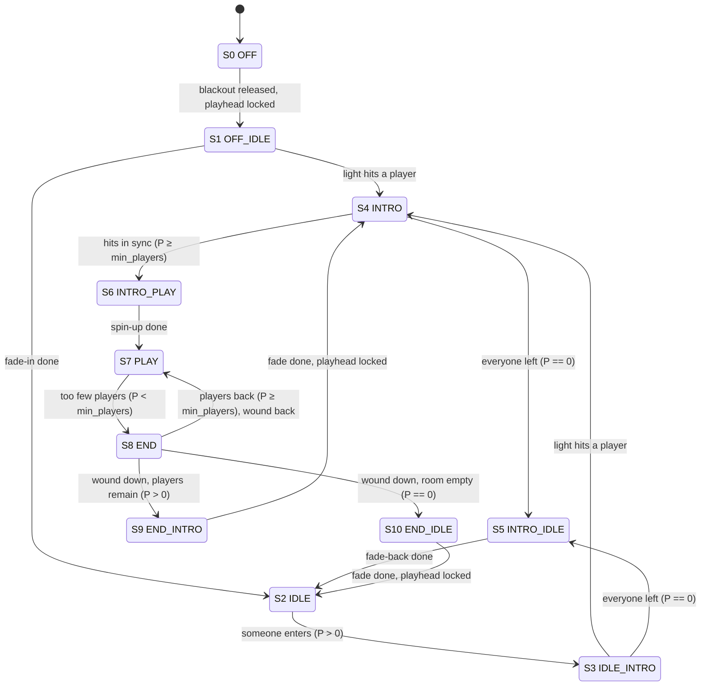

# White Space — States
Eleven states played by the `StateMachine` (`apps/white_space/statemachine/`). This document is the
source of truth for the installation's dramaturgy; the state classes in `statemachine/states.py` point
here. Transition lists are in **priority order**, matching each class's `needs_state_change()`. Timing
tunables live in the `states` settings group; each state returns its mix from `update()`.

Vocabulary:

- **P** — the live player count: the LERP poses (`LAYERS.md`, *Inputs*), debounced
  by `states.count_hold_seconds`
- **min_players** — `states.min_players`, the players the show needs (`studio.json`: 2): that many alike hits
  in a row spin it up, fewer present end it, and END winds back to PLAY once they are back
- **in sync** — the most recent hits, within one round, whose poses are alike: every pair of them fully
  alike (`SIMILARITY.md`: the arm postures within `angle_tolerance` of each other) and every one fully out of
  neutral. `sync.hits` is how many in a row, `sync.distance` the largest distance between them in degrees; a
  hit that does not match restarts the count from itself at once. `HitSync` (`pose/hit_sync.py`) records
  each hit's pose off the LERP frame and publishes the streak on the board
- **neutral** — arms hanging: the arm joint furthest from neutral within
  `pose.arm_deviation_extractor.min_degrees` of it (`ArmDeviation` 0; 1 from `max_degrees`, linear between).
  For the hit sync it is a gate: a hit counts only fully out of neutral (`ArmDeviation` 1), so pings never
  spin the show up. On the `Similarity` feature it is a ramp: a pair is weighted by the deviation of its
  member closer to neutral (`pose/neutral_weight.py`), so a pose leaving neutral never jumps a level
- **bar** — one full playhead cycle, the content clock
- **hit** — the tick the playhead is closest to a player, once per pass (`PlayheadCrossing` in
  `pose/playhead_offset.py`): the tick a one-frame `beam_flash` lights, the instrument marks the player, and
  `HitSync` reads their pose. The playhead crosses each player once per round, so a round has one hit per
  player and the players hear each hit as that pose's sound
- **readout mode** — the fixture reads beam mode below 200 rpm and projection mode at or above, switching
  on receipt of the *commanded* rpm (see `CALIBRATION.md` *Two modes, two offsets*). A spin-up is in
  projection mode from its first packet; a wind-down is in beam mode from its first packet.
- **playhead lock** — the playhead tracks the measured rotation at BEAM (`Playhead.is_locked`). At boot
  that is the first trustworthy measurement. After a spin-down from PROJECTION it waits for a fresh
  measurement above `beam_rpm` and then one settled within tolerance of it: being under the 200 rpm
  sensor ceiling is not enough, and stale readings from before the spin-up do not count.
- **projecting** — PROJECTION is commanded and the sensor has been silent for 2.5 ceiling periods, so the
  bar spins fast enough for the projection to show (`Playhead.is_projecting`). Distinct from
  *projection mode*, the fixture's readout, which switches on the commanded rpm.
- **DIM** — the dimmed line level, `states.dim_level`; **BRIGHT** is the line at full.

What **in sync** means in degrees, the settings behind it and how they depend on each other:
`SIMILARITY.md`.

## Summary

| #   | State      | P                 | Duration                       | Motor      | White                              | Blue                 | Pose sound | Secondary sound               |
|-----|------------|-------------------|--------------------------------|------------|------------------------------------|----------------------|------------|-------------------------------|
| S0  | OFF        | —                 | until unpinned and locked      | BEAM       | none                               | none                 | no         | none                          |
| S1  | OFF_IDLE   | —                 | `off_idle_bars`                | BEAM       | dark → BRIGHT line                 | none → sound visuals | no         | none → soundscape             |
| S2  | IDLE       | 0                 | ∞                              | BEAM       | BRIGHT line                        | sound visuals        | no         | soundscape                    |
| S3  | IDLE_INTRO | > 0               | until hit                      | BEAM       | BRIGHT line                        | sound visuals        | before hit | soundscape + anticipatory cue |
| S4  | INTRO      | > 0               | ∞                              | BEAM       | DIM line + flash on hit            | none                 | yes        | none                          |
| S5  | INTRO_IDLE | 0                 | `intro_idle_bars`              | BEAM       | DIM → BRIGHT line                  | none → sound visuals | no         | none → soundscape             |
| S6  | INTRO_PLAY | ≥ min_players     | `spin_up_seconds`              | PROJECTION | dark → instrument + playhead       | none → instrument    | yes        | enhance spin-up chaos         |
| S7  | PLAY       | ≥ min_players     | ∞                              | PROJECTION | instrument + playhead              | instrument           | yes        | enhance spin                  |
| S8  | END        | < min_players     | `end_bars`, both ways          | PROJECTION | instrument + playhead → full white | instrument → none    | open       | enhance spin → none           |
| S9  | END_INTRO  | < min_players, >0 | `spin_down_seconds`, then lock | BEAM       | wall → DIM line                    | none                 | open       | open                          |
| S10 | END_IDLE   | 0                 | `spin_down_seconds`, then lock | BEAM       | wall → BRIGHT line                 | none → sound visuals | open       | open                          |

Durations name settings in the `states` group; `studio.json` sets `off_idle_bars` 1, `intro_idle_bars` 2,
`spin_up_seconds` 14, `end_bars` 8 and `spin_down_seconds` 6. `open` cells are listed under *Open*. The
P column is the stand-alone show; in session mode S6 is entered with any P > 0 and S7 and S8 run on time
whatever the count (see below).

## Transition graph

The graph is the stand-alone show; the exact conditions and their settings are in each state's
*Transitions* list.

The machine always **boots into OFF** — dark, motor at BEAM — and wakes through OFF_IDLE by itself once
the playhead has locked, so power-on is the same wake as a blackout release. The persisted
`manual.select` is only the goto target, entered on `goto`, never at start. Nothing else in the preset
is forced: a saved `manual.hold` or `blackout` comes back as saved, and holds OFF until released. **OFF (S0)** is also
entered from any state by pinning `blackout` (an operator input, so it is not drawn as an edge above), and
leaves by condition like any other state — through OFF_IDLE, once neither the pin nor a missing lock
holds it. In **session mode** the two open-ended states run on time: INTRO spins up after `session.intro_seconds`
with anyone present, PLAY runs `session.play_seconds` whatever the count, and END only winds down (no
return to PLAY), so a session always concludes.

**Boot — the app starts as the startup preset says, and forces nothing.** A preset is written only by
Save or Save As in the panel, so a saved state is one an operator chose; the app cannot tell a power cycle
from a launch, so every start is the same start. What keeps the motor from powering on into PROJECTION:

1. **State machine**: always boots into OFF (dark, motor BEAM) and wakes through OFF_IDLE only once the
   playhead has locked; the persisted `select` is the goto target and is not entered at start
   (`statemachine/machine.py`; `test_startup_ignores_persisted_select`, `test_boot_waits_for_the_lock`).
2. **Motor**: there is no manual mode field — the arbitration is debug > machine command > **STOPPED**, so
   before the machine's first tick (or with the machine disabled) nothing spins (`light/motor.py`
   `_target_mode`; `test_boot_without_command_is_stopped`).
3. **The site preset**: saved with the debug select OFF and the dummy off. A projection layer saved as
   selected comes back selected and spins the fixture up at power-on; the Conductor warns about it in the log
   (`light/conductor.py`; `test_a_saved_debug_selection_comes_back_as_saved`), it does not reset it.
4. **A simulated motor never reaches the fixture**: while `light.motor_simulate` is on the light sender sends
   nothing, no rpm and no pixels, read live (`inout/osc_light_sender.py`). The desk preset is saved with it
   on, with the debug layer, the dummy and any hold as wanted, and set as the startup preset.

On top of these, `osc_light` holds the commanded rpm at 0 for `startup_delay` seconds after connecting,
giving the motor controller one clean 0 → target edge. With the site preset, PROJECTION is reachable only
through an explicit runtime action: the show's own sync into INTRO_PLAY, an operator goto to a PROJECTION
state, or selecting a projection layer in the debug select.

**Hardware failsafe**: if the machine does not rotate, it turns the lights off **(site fact)**, so a
stalled spin-down cannot strand bright lights on a stationary bar. A sensor failure on a machine that is
still spinning can hold a state (S9/S10 waiting for the lock); that is an operator-intervention case
(`goto` or the debug select), not a safety one. A debug layer soloed during S9/S10 also holds it: the
`beam_wind_down` fade pauses while the layer is not drawn (`LAYERS.md`, *beam_wind_down*).

**Shutdown**: a clean quit ends with an explicit **blackout from each sender**. The light sender sends
rpm 0, an all-zero frame and rpm 0 again, so the fixture goes dark and decelerates at once; the sound
sender sends its zeroed bundle (`/global/state` −1). The firmware's Ethernet watchdog (packet silence →
motor stop and blank after several revolutions) covers only the crash path, where `stop()` never runs.

## Layers

Each state composes its **mix**: a weighted list of layers, returned every tick (`p` = the state's
progress; weights may differ per channel). The layers' modes, inputs and settings are indexed in
`LAYERS.md` (*Index — show layers*). The playhead is `beam_playhead` in beam mode and the pose instrument's
marker in projection mode, since the light data protocol differs between the two. Debug layers are never in a state's
mix; they are reached through the `light.debug` select, and OFF there returns the show where it would
have been (see `LAYERS.md`).

---

## S0 — OFF

The installation is off: dark and silent. An operational state, not a show beat — end of day, before
opening, and the state the machine boots into. On the wire, `/global/state` 0 means off.

The rotor keeps sweeping at BEAM: OFF is "dark and silent", not "powered down". Stopping would silence the
fall sensor and unlock the playhead, so waking would need a full re-acquire; sweeping keeps the content
clock locked and the wake instant. Quitting the app is the true stop.

Two things can hold it, and the exit waits for both to clear: the operator's pin (`blackout`) and the
physics (the playhead not yet locked at BEAM — at boot the motor comes up from a standstill and needs a few
revolutions to lock). After a blackout the lock is already there, so the wake starts at once.

- **Players**: — (ignored) · **Duration**: as long as `blackout` is pinned or the playhead is
  unlocked · **Motor**: BEAM
- **Transitions**: **in** — boot; or pinning `states.blackout`, the machine's highest-priority input: from
  any state, beating `hold` and `goto`. **out** — `blackout` released *and* playhead lock → S1 OFF_IDLE. A
  silent sensor holds it dark — the operator `goto` case, as for S9/S10.
- **Mix**: empty — the bar is turning and the fixture is in beam mode, so darkness comes from the mix alone
- **White / Blue**: none
- **Pose sound / Secondary sound**: no

## S1 — OFF_IDLE

The wake, at boot and after a blackout alike. OFF has let go (blackout released, playhead locked), so over
`off_idle_bars` the searchlight and the soundscape fade up out of the dark into IDLE's look. The sweep is already
running and locked underneath; only the light returns.

If the sweep crosses a player mid-fade the intro begins right there (the hit's own flash covers the
step from the fading level to INTRO's dim line). With people present but not yet hit it lands in IDLE and
moves straight on to IDLE_INTRO — the identical look, so seamless — to wait for the sweep: the room is
re-introduced by the light rather than dropped into the middle of INTRO.

- **Players**: — (either way) · **Duration**: `off_idle_bars` · **Motor**: BEAM
- **Transitions**
  1. hit → S4 INTRO
  2. fade complete → S2 IDLE
- **Mix**: `beam_playhead` and `beam_blue_sound`, both eased 0 → 1 over the bar
- **White**: fade dark → BRIGHT line · **Blue**: fade-in sound visuals
- **Pose sound**: no · **Secondary sound**: fade-in soundscape

## S2 — IDLE

The white searchlight (playhead) spins slowly through the empty space, supported by an atmospheric
soundscape that evokes curiosity and plays on both blue lamps.

- **Players**: 0 · **Duration**: ∞ · **Motor**: BEAM
- **Transitions**
  1. P > 0 → S3 IDLE_INTRO
- **Mix**: `beam_playhead` 1.0 · `beam_blue_sound` 1.0
- **White**: BRIGHT line — `beam_playhead` full
- **Blue**: sound visuals — `beam_blue_sound`
- **Pose sound**: no
- **Secondary sound**: SEARCHLIGHT soundscape

## S3 — IDLE_INTRO

Someone has entered. The searchlight keeps sweeping at full brightness, but the sound is already stirring:
the pose instrument starts a little *before* the actual hit — this anticipation is the reason the state
exists. When the bright beam strikes the person the intro begins: the line snaps to dim and the soundscape
stops.

- **Players**: > 0 · **Duration**: until hit · **Motor**: BEAM
- **Transitions**
  1. hit by light → S4 INTRO
  2. P == 0 → S5 INTRO_IDLE *(the person left before being hit; INTRO_IDLE ramps from its entry
     brightness, so the pass-through causes no dip)*
- **Mix**: `beam_playhead` 1.0 · `beam_blue_sound` 1.0
- **White**: BRIGHT line — `beam_playhead` full
- **Blue**: sound visuals — `beam_blue_sound`
- **Pose sound**: yes — deliberately audible before the hit (the anticipation)
- **Secondary sound**: SEARCHLIGHT + anticipatory cue building toward the hit

## S4 — INTRO

The pose instrument is introduced. Neutral poses give a glass ping; arms raised gives a heavy bass; all
other arm positions give unique sounds. The dim playhead flashes bright as it crosses each player, and each
crossing is a hit the players hear as that pose's sound: the show advances when they have heard the same
sound `min_players` times in a row.

- **Players**: > 0 · **Duration**: ∞ · **Motor**: BEAM
- **Transitions**
  1. P == 0 → S5 INTRO_IDLE
  2. `sync.hits` ≥ min_players (the last min_players hits **in sync**, *Vocabulary*) and P ≥ min_players →
     S6 INTRO_PLAY. A neutral hit is alike to nothing, so pings never spin the show up; a hit that does not
     match restarts the count at once, and the count is visible on the panel as it builds
  3. session: elapsed ≥ `session.intro_seconds` → S6 INTRO_PLAY *(checked after P == 0, so an empty room
     never spins up)*
- **Mix**: `beam_playhead` DIM · `beam_flash` 1.0 (reset on entry)
- **White**: DIM line + BRIGHT flash on hit
- **Blue**: none
- **Pose sound**: yes (only sound)
- **Secondary sound**: none

## S5 — INTRO_IDLE

The players have left mid-intro. Over `intro_idle_bars` the dim line fades back to the bright searchlight and
the soundscape fades back in.

- **Players**: 0 · **Duration**: `intro_idle_bars` · **Motor**: BEAM
- **Transitions**
  1. bars ≥ `intro_idle_bars` → S2 IDLE
- **Mix**: `beam_playhead` ramp(entry level → 1.0) · `beam_blue_sound` ramp(entry level → 1.0)
- **White**: fade DIM → BRIGHT, from wherever the lamp was on entry — no dip
- **Blue**: fade-in sound visuals, also from the entry level (0 arriving from INTRO, already 1.0 on the
  IDLE_INTRO pass-through — no blink)
- **Pose sound**: no
- **Secondary sound**: fade-in SOUNDSCAPE

## S6 — INTRO_PLAY

The players have synced their poses: the machine spins up. The pose instrument takes over from the
line during the spin-up, and the sound enhances the accelerating chaos.

- **Players**: ≥ min_players (session: > 0) · **Duration**: spin-up (`spin_up_seconds`) · **Motor**: PROJECTION
- **Transitions**
  1. elapsed ≥ `spin_up_seconds` → S7 PLAY *(stands in for "at motor top speed": the sensor is blind above
     200 rpm, so time approximates it)*
- **Mix**: `beam_playhead` DIM until **projecting**, then `pose_instrument` white 1.0 (hard) / blue
  ease-in — per-channel weights. `pose_instrument` is reset on entry, so each
  show cycle starts a fresh instrument; PLAY does not reset it, because END's wind-back re-enters PLAY with
  the running instrument.
- **White**: dark until projecting — the fixture is in projection mode from the first packet, so the
  `beam_playhead` beam light in the mix is not read. Once projecting, the instrument and the playhead line
  snap in (a hard mix); the spin-up through the ceiling is fast, so this is near entry.
- **Blue**: pose instrument **eases in** from projecting over the remaining spin-up, reaching 1.0 at the
  PLAY hand-off
- **Pose sound**: yes (effect?)
- **Secondary sound**: ENHANCE spin-up chaos

## S7 — PLAY

The players play the instrument, creating music and light patterns. The space between players
holding the same pose fills with light.

- **Players**: ≥ min_players (session: any) · **Duration**: ∞ (session: `session.play_seconds`) · **Motor**: PROJECTION
- **Transitions**
  1. stand-alone: P < min_players (debounced) → S8 END
  2. session: elapsed ≥ `session.play_seconds` → S8 END *(the count is not checked: a session plays out
     its time)*
- **Mix**: `pose_instrument` 1.0
- **White**: the pose instrument — patterns per pose plus the sync fill between similarly-posed
  players — and the playhead line at full white
- **Blue**: pose instrument (`pose_instrument`'s blue)
- **Pose sound**: yes
- **Secondary sound**: ENHANCE spin

## S8 — END

Fewer than the min_players remain: the machine begins its end. Over `end_bars` the light crosses to full
white and the sound reflects it. If players return, the white winds back and PLAY resumes — the ramp
runs both ways, never jumping, and at p = 0 the mix equals PLAY's, so the hand-over back is seamless.

- **Players**: < min_players · **Duration**: `end_bars` bars, bidirectional · **Motor**: PROJECTION
- **Transitions**
  1. wound down (p ≥ 1) and P > 0 → S9 END_INTRO
  2. wound down (p ≥ 1) and P == 0 → S10 END_IDLE
  3. wound back (p ≤ 0) and P ≥ min_players → S7 PLAY *(stand-alone only; in session mode the wind-back is disabled
     so a session always concludes)*
- **Mix**: `pose_instrument` 1−p · `flood` ease-out(p)
- **White**: instrument and playhead line fade as the flood crosses to full white
- **Blue**: fades out with the instrument — `pose_instrument` is the only blue source, so one ramp crosses
  the white to full and fades the blue out together
- **Pose sound**: DISTORTION? (based on progress)
- **Secondary sound**: fade out enhanced spin + DISTORTION? (based on progress)

## S9 — END_INTRO

Players remain, so the machine returns to the intro: the wall of white **fades away during the
spin-down**, revealing the dim playhead line underneath. The fade is timed; the state hands over once it
is complete and the playhead lock holds, because the landing state needs a live playhead.

The fade lives in the `beam_wind_down` layer, not in the mix weights (see `LAYERS.md` *beam_wind_down*).
It is timed rather than driven by the measured deceleration because the sensor is silent above 200 rpm;
`states.spin_down_seconds`, beside `spin_up_seconds`, is tuned by hand to the physical spin-down.

- **Players**: < min_players, > 0 · **Duration**: the spin-down (fade complete, then the lock) · **Motor**: BEAM
- **Transitions**
  1. fade complete (`progress` ≥ 1) and playhead lock → S4 INTRO
- **Mix**: `beam_wind_down` 1.0 · `beam_playhead` DIM — **constant weights**; the dynamics live inside
  `beam_wind_down` (reset on entry). The dim line sits underneath from the start and is *revealed* as the
  wall dies, so there is no splice and no seam into INTRO (the front sums past full and clips until the
  wall drops away; monotonic to DIM)
- **White**: both white lamps fade BRIGHT → gone over `spin_down_seconds`; the front lands on the dim line
  underneath, the back goes out
- **Blue**: none
- **Pose sound**: fade out distortion?
- **Secondary sound**: fade out distortion?
- **Progress** (OSC `/global/state/progress`): the layer's own fade readout (0 = full wall, 1 = gone), so the
  sound-side distortion fade rides the actual fade

## S10 — END_IDLE

The space is empty: the wall of white fades away during the spin-down, revealing the bright searchlight
line; the distortion disappears and the searchlight soundscape returns with it. The same engine as S9 —
`beam_wind_down` owns the timed fade, and the state hands over once it is complete and the playhead lock
holds — landing on the BRIGHT line instead of the dim one.

- **Players**: 0 · **Duration**: the spin-down (fade complete, then the lock) · **Motor**: BEAM
- **Transitions**
  1. fade complete (`progress` ≥ 1) and playhead lock → S2 IDLE
- **Mix**: `beam_wind_down` 1.0 · `beam_playhead` 1.0 · `beam_blue_sound` p — the line at constant full
  underneath the dying wall (the front lamp clips at full throughout: constant BRIGHT, no seam into IDLE);
  the sound visuals fade in on p = the layer's fade readout
- **White**: stays BRIGHT — the front is at full the whole way, while the back lamp rides the wall down and
  goes out over `spin_down_seconds`
- **Blue**: sound visuals fade in with the wall's fade
- **Pose sound**: fade out distortion?
- **Secondary sound**: fade out distortion?
- **Progress** (OSC `/global/state/progress`): the layer's own fade readout, so the sound-side fades ride the
  actual fade

---

## Open

- **S3**: the anticipatory cue's design (Max side)
- **S6**: the "(effect?)" on pose sound (Max side)
- **S6**: whether to draw a line in the projection while it is still dark during the spin-up
- **S7**: an inactivity exit — "no action for x bars → END", with an action-gated wind-back in END to
  match; left out to keep the graph simple
- **S8–S10**: the distortion treatment (Max side); `/global/state/progress` is the ramp that drives it
